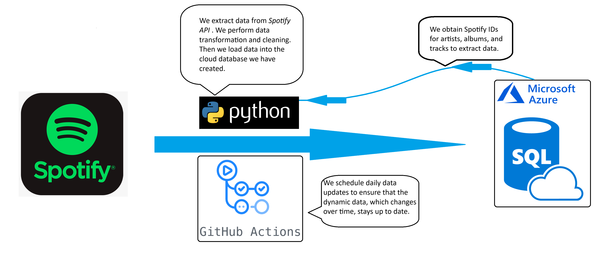

# Data Scientist

### Education
- M.S., High Energy Physics & Cosmology @ University of Crete (2019 - 2020)
- B.S., Physics @ University of Crete (2014 - 2019)

### Technical Skills
- Programming Languages: Python, SQL
- Tools: MS Excel, MS Power BI, Tableau
- Mathematical Expertise: Linear Algebra, Multivariate Calculus, Statistics

## Portfolio

### [**Rock Music Analytics App**](https://rock-music-analytics.streamlit.app)
Made with
##### 🎯 Project purpose
The aim of this project is to visualize data on legendary rock artists, making it easy for users to explore and answer questions through interactive data visualizations.

##### 🗐 Results
The result is a web application, where each page serves a specific purpose as described below.
##### 🎸 Tracks Page: 
  
This page offers insights into track popularity trends, audio feature distributions, and comparisons between tracks. Users can apply filters for track popularity and audio features to answer a variety of questions.

##### 🧑🏽‍🎤 Artists Page: 
  
This page presents popularity and follower trends for legendary rock artists.

##### 📊 Clustering Page: 
  
This page displays the results of a clustering analysis, where tracks are grouped based on their audio features. Users can filter tracks by popularity and/or artist to explore the clusters further.

       
[GitHub Repository](https://github.com/Vangelis-Chocholis/rock-music-analytics-app)

--------------------------------------

### Extract-Transform-Load: From Spotify to Azure
##### Summary:
- Objective: Automate data extraction from the Spotify API for well-known rock artists.
- Result: Implemented a cloud database that is updated
daily through an automated ETL process.

 
      

[GitHub Repository](https://github.com/Vangelis-Chocholis/ETL_Spotify_data)

----------------------------------------------

