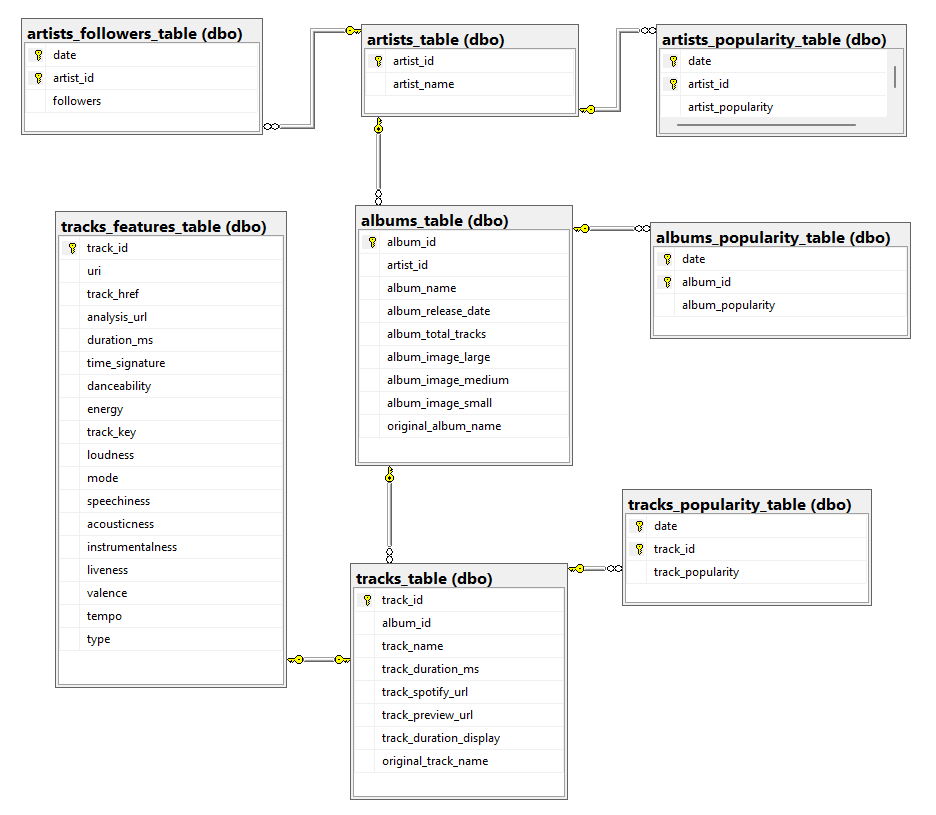

# Data Scientist

### Education
- M.S., High Energy Physics & Cosmology @ University of Crete (2019 - 2020)
- B.S., Physics @ University of Crete (2014 - 2019)

### Technical Skills
- Programming Languages: Python, SQL
- Tools: MS Excel, MS Power BI, Tableau
- Mathematical Expertise: Linear Algebra, Multivariate Calculus, Statistics

## Projects

### **Rock Music Analytics App**
📌 [GitHub repo](https://github.com/Vangelis-Chocholis/rock-music-analytics-app)  
📌 [Rock Music Analytics App](https://rock-music-analytics.streamlit.app)
##### 🎯 Project purpose
The goal of this project is to visualize data on legendary rock artists, making it easy for users to explore and answer questions through interactive data visualizations.

##### 🗐 Results
The result is a web application built with Python, where each page serves a specific purpose as described below.
##### 🎸 Tracks Page: 
  
This page offers insights into track popularity trends, audio feature distributions, and comparisons between tracks. Users can apply filters for track popularity and audio features to answer a variety of questions.

##### 🧑🏽‍🎤 Artists Page: 
  
This page presents popularity and follower trends for legendary rock artists.

##### 📊 Clustering Page: 
  
This page displays the results of a clustering analysis, where tracks are grouped based on their audio features. Users can filter tracks by popularity and/or artist to explore the clusters further.

##### 🗃️ Data
The data have been collected from the Spotify API and stored in a cloud database. An automated E.T.L. process is running every day to update the data. For details, refer to the [E.T.L. GitHub repository](https://github.com/Vangelis-Chocholis/ETL_Spotify_data)

--------------------------------------

### Extract-Transform-Load: From Spotify to Azure
📌 [GitHub repository](https://github.com/Vangelis-Chocholis/ETL_Spotify_data)
##### Summary:
For this project, we created a SQL Server database on the cloud using Microsoft Azure. The objective was to extract data for legendary rock 🎸 artists from the Spotify API, transform/clean the data, and then load it into our cloud database, resulting in a database that is automatically updated daily.

##### **Extract-Transform-Load process:**

##### Extract-Transform:
Data extraction and transformation/cleaning are handled in the `extract_transform_data.py` Python script. In this script we have implemented functions that extract artist data from Spotify API given a list of artist names. Then they get every album and track for each artist. Also, using suitable regular expressions they keep only original albums and tracks by removing live, demo, deluxe versions. We end up with a single function `get_static_tables` at the end of the script  that extracts and transforms/cleans every static data table.

##### Load:
We created the database tables and also load the static (time independent) data by running the Python script `create_DB_load_static_data.py` once. At this stage, we connected Python to our database to execute SQL queries for creating our tables. The tables and their connections are illustrated in the following database diagram.

 Moving forward, we called `get_static_tables` function we mentioned earlier to get the static tables and finally loaded them into our database using `pandas`.

For dynamic data, such as artist/album/track popularity and artist followers, we have scheduled daily database updates by executing the `main.py` Python script with GitHub Actions. This Python script manages the ETL process for the dynamic data tables every day and writes to the `status.log` to indicate whether the code execution was successful. This ETL process is illustrated in the image that follows.

----------------------------------------------

